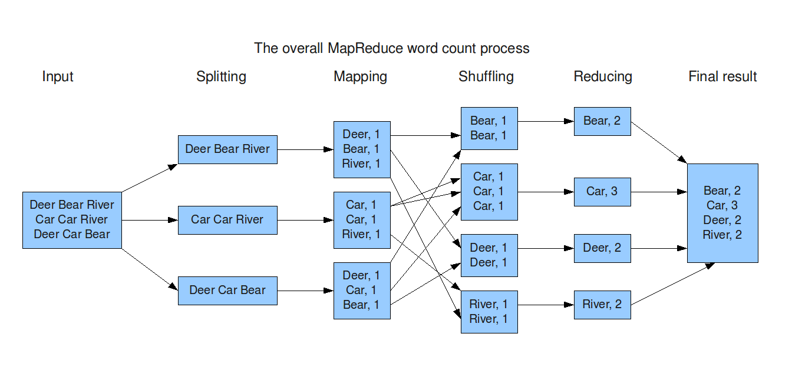
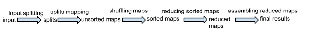

## MapReduce - SPLIT et MAP

### Prérequis et documentation pour les questions suivantes :

- connaître l'[architecture de MapReduce](https://www.guru99.com/introduction-to-mapreduce.html)

- Connaître la convention des nom des fichiers pour notre TP

- connaître le vocabulaire: S UM SM RM (Splits, Unsorted Maps, Sorted Maps, Reduced Maps) - voir en cours

  

  

### Un MASTER qui déploie les splits

Créez trois fichiers correspondants à des "splits" dans le répertoire temporaire. Dans un premier temps, créez ces fichiers manuellement. 

 /tmp/\<votre nom d'utilisateur\>/splits

S0.txt S1.txt S2.txt.\
S0.txt contient:

Deer Beer River

S1.txt contient:

Car Car River

S2.txt contient:

Deer Car Beer

Modifiez votre MASTER pour qu'il copie les 3 fichiers de splits dans 3 ordinateurs différents, en ne copiant qu'un slip par machine. Par exemple, s'il existe 3 machines et 3 splits, la première machine aura le premier split, la deuxième le deuxième etc. Pour cela vous utiliserez le fichier précédemment créé qui contient la liste des machines que vous voulez utiliser pour votre projet.

Attention, le répertoire /tmp/\<votre nom d'utilisateur\>/splits doit être créé sur les 3 ordinateurs s'il n'existe pas. Cette création peut se faire de manière automatique (en créant de manière programmatique ces répertoires). Attention de faire attention de bien attendre que la création des dossiers soit bien effectuée avant de lancer la copie des splits. Comment attendez-vous que la création des dossiers soit bien effectuée avant de copier véritablement les fichiers?\
De la même manière que le programme DEPLOY, le MASTER va copier ces splits vers 3 ordinateurs dont la connection SSH fonctionne.

Votre programme MASTER lance-t-il les copies de manière séquentielle (les unes après les autres) ou de manière parallèle?

### Un SLAVE qui fait la phase de map

Modifiez le SLAVE pour qu'il calcule un map à partir d'un split.

Pour cela, il prend un mode de fonctionnement en argument: 0 correspond au calcul du map à partir d'un split, puis un nom de fichier "Sx.txt" en entrée depuis le dossier splits et calcule un fichier "UMx.txt" en sortie dans le dossier maps, avec x variant (ici de 1 à 3). De la même manière que précédemment, le dossier maps doit être créé avant de pouvoir écrire des fichiers dedans. Vous devez attendre que le dossier maps soit créé avant de travailler avec. Comment attendez-vous que le dossier maps soit bien créé avant de travailler avec?

Le nom du fichier sera donné comme argument args du main:\
public static void main (String\[\] args)\
\
Testez dans un terminal le slave.jar comme suit:

cd /tmp/\<votre nom d'utilisateur\>/\
java -jar slave.jar 0 /tmp/\<votre nom d'utilisateur\>/splits/S0.txt\
\
Le fichier /tmp/\<votre nom d'utilisateur\>/maps/UM0.txt doit être créé contenant\
Dear 1\
Beer 1\
River 1\
\
Testez le fonctionnement de votre SLAVE avec le fichier S1.txt contenant\
Car Car River\
Testez dans un terminal le JAR comme suit:

cd /tmp/\<votre nom d'utilisateur\>/\
java -jar slave.jar 0 /tmp/\<votre nom d'utilisateur\>/splits/S1.txt\
\
Le fichier /tmp/\<votre nom d'utilisateur\>/maps/UM1.txt doit être créé contenant\
Car 1\
Car 1\
River 1

Attention: Comme votre SLAVE est modifié, utilisez le DEPLOY pour déployer la nouvelle version.

Posez-vous la question: pourquoi retrouvons-nous deux lignes

Car 1

Car 1

Au lieu d'une seule ligne

Car 2

Un indice: la phase de reduce qui arrivera plus tard, fera une addition des valeurs. Dans ce cas, la "fonction" de reduce est très simple: c'est une grande addition. Imaginez une fonction de reduce beaucoup plus complexe qui effectue un algorithme complexe appliqué sur toutes les valeurs\...

### Un MASTER qui lance les SLAVE pour la phase de map.

Modifiez le MASTER pour qu'il lance la phase de map sur plusieurs machines et affiche "MAP FINISHED". Pour cela vous utiliserez le fichier précédemment créé qui contient la liste des machines que vous voulez utiliser pour votre projet.

Pour bien synchroniser le MASTER avec les SLAVES, veillez à afficher "MAP FINISHED" qu'une fois tous les SLAVEs terminés et uniquement quand tous les SLAVEs sont terminés, PAS AVANT! Le MASTER doit donc attendre que SLAVEs se terminent correctement.

Comment faites-vous pour qu'un process lancé avec ProcessBuilder en Java attende la fin de l'exécution du processus ?

Votre programme MASTER lance-t-il les SLAVE de manière séquentielle (les uns après les autres) ou de manière parallèle?