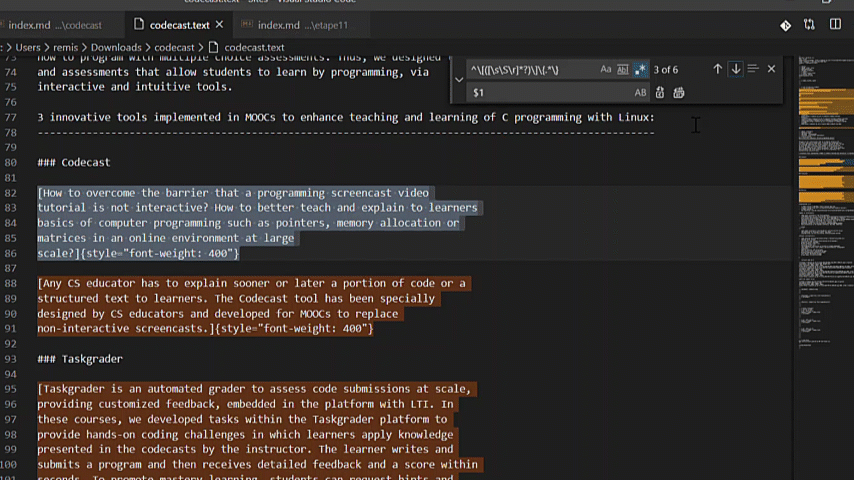

Sometimes I convert HTML pages extracted from websites to Markdown using [Pandoc](https://pandoc.org/). Here is an example using this command:

```
pandoc -s -r html https://codecast.wp.imt.fr/ -o codecast.md
```

The problem is that it often generates extra information following the pattern

```
[interesting text that
I want
to keep]{uninteresting parameters extracted from HTML that I want to delete}
```

for example:

```
[Any CS educator has to explain sooner or later a portion of code or a
structured text to learners. The Codecast tool has been specially
designed by CS educators and developed for MOOCs to replace
non-interactive screencasts.]{style="font-weight: 400"}
```

I found an easy way to clean the Markdown using Visual Studio Code "find and replace" feature with regex. Here is the regular expression that I used:

```
^\[([\s\S\r]*?)\]\{.*\} 
```

The `^` means beginning of a line. If you want to find this pattern in the middle of lines, just delete it.

The `\[       \]` means that I want to search something between squared brackets.

The `[\s\S\r]` means a *whitespace* character `\s` (space, tab...) OR a character that is *not a whitespace* `\S` (a,b,c...) OR a new line character `\r`. Note that in Visual Studio Code regex system, the `\s` does **NOT** include the new line (even if I would think it's a *whitespace* character), that's why I specifically add the `\r`.

The `(x*?)`  - here `x` is the expression just above - asks to capture a group using `(` and `)` , with the character `x` appearing zero or more times with `*` and once or none with `?`. Maybe you are lost at this point! Anyway, because we asked for a capture, we will be able to use `$1` as a variable containing the captured text!

 The `\{.*\}` means curly braces with something inside - Here I could also use  `[\s\S\r]` instead of  `.*` 

Anyway, I then replace with `$1` and here is the result:

